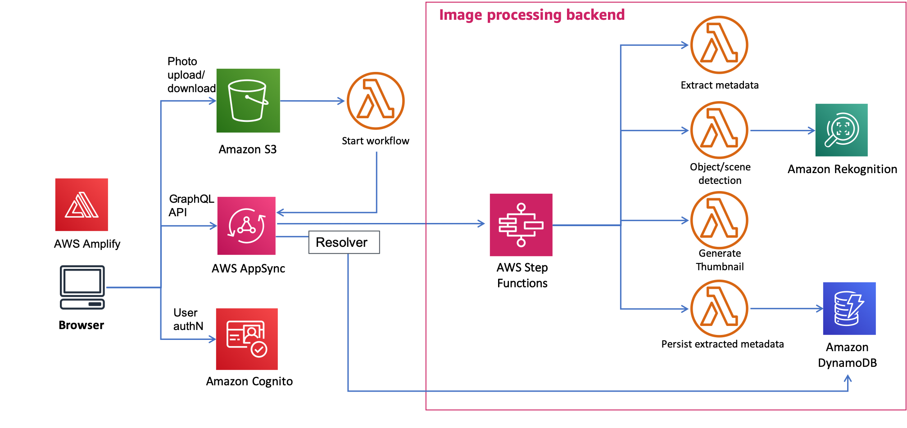
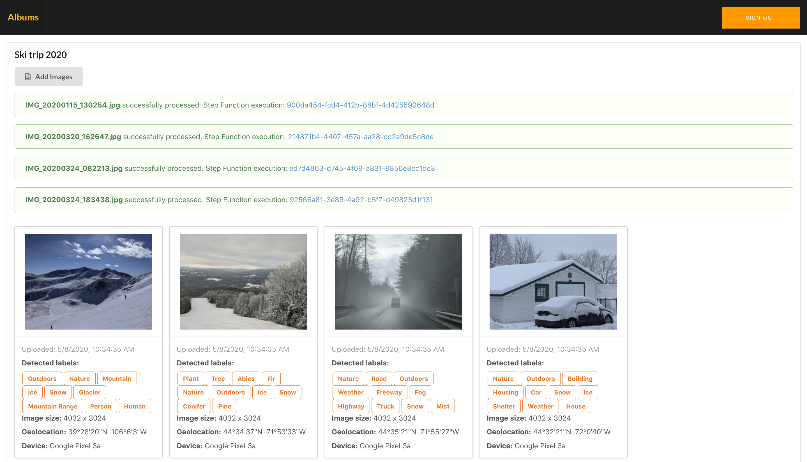
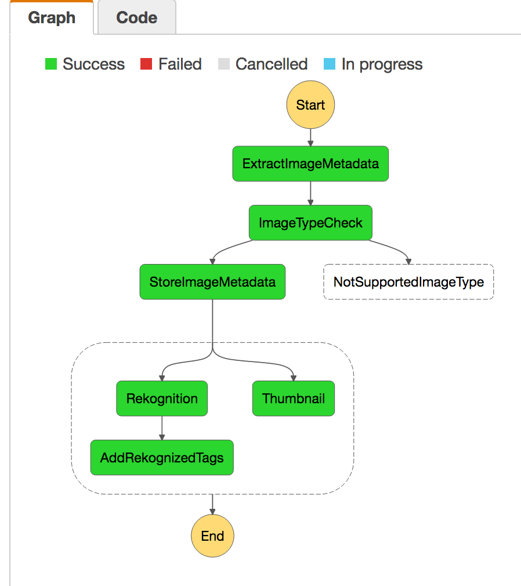

# Serverless Reference Architecture: Image Recognition and Processing Backend

The Image Recognition and Processing Backend demonstrates how to use [AWS Step Functions](https://aws.amazon.com/step-functions/) to orchestrate a serverless processing workflow using [AWS Lambda](http://aws.amazon.com/lambda/), [Amazon S3](http://aws.amazon.com/s3/), [Amazon DynamoDB](http://aws.amazon.com/dynamodb/) and [Amazon Rekognition](https://aws.amazon.com/rekognition/). This workflow processes photos uploaded to Amazon S3 and extracts metadata from the image such as geolocation, size/format, time, etc. It then uses image recognition to tag objects in the photo. In parallel, it also produces a thumbnail of the photo.

This repository contains sample code for all the Lambda functions depicted in the diagram below as well as an AWS CloudFormation template for creating the functions and related resources. There is also a test web app that you can run locally to interact with the backend.



### Walkthrough of the architecture
1. An image is uploaded to the `PhotoRepo` S3 bucket under the "Incoming/" prefix
2. The S3 upload event triggers the `ImageProcStartExecution` Lambda function, which kicks off an execution of the `ImageProc` state machine in AWS Step Functions, passing in the S3 bucket and object key as input parameters.
3. The `ImageProc` state machine has the following sub-steps:
  * Read the file from S3 and extract image metadata (format, EXIF data, size, etc.)
  * Based on output from previous step, validate if the file uploaded is a supported file format (png or jpg). If not, throw `NotSupportedImageType` error and end execution.
  * Store the extracted metadata in the `ImageMetadata` DynamoDB table
  * In parallel, kick off two processes simultaneously: 
     * Call Amazon Rekognition to detect objects in the image file. If detected, store the tags in the `ImageMetadata` DynamoDB table
     * Generate a thumbnail and store it under the "Thumbnails/" prefix in the `PhotoRepo` S3 bucket 

### Test web app
You can use the test web app to upload images and see the result of the image recognition and processing workflow. 



## Running the Example
 
#### Option 1: Launch the CloudFormation Template in US West - Oregon (us-west-2) 
The backend infrastructure can be deployed in US West - Oregon (us-west-2) using the provided CloudFormation template.

Click **Launch Stack** to launch the template in the US West - Oregon (us-west-2) region in your account:

[](https://console.aws.amazon.com/cloudformation/home?region=us-west-2#/stacks/new?stackName=photo-sharing-backend&templateURL=https://s3-us-west-2.amazonaws.com/media-sharing-refarch/cloudformation/image-processing-v3-node8.output.yaml)

> In the last page of the wizard, make sure to click the checkboxes to accept:
> 
> * I acknowledge that AWS CloudFormation might create IAM resources.
> * I acknowledge that AWS CloudFormation might create IAM resources with custom names.
> * I acknowledge that AWS CloudFormation might require the following capability: `CAPABILITY_AUTO_EXPAND`
> 
> before clicking **"Create stack"**


#### Option 2: Launch the CloudFormation Template in a different region than US West - Oregon (us-west-2) 

<details>
<summary><strong> Expand for instructions </strong></summary><p>


If you would like to deploy the template to a different region (must be a region that supports **Amazon Rekognition** and **AWS Step Functions**, e.g. US East (N.Virginia) or EU (Ireland), you need a S3 bucket in the target region, and then package the Lambda functions into that S3 bucket by using the `aws cloudformation package` utility.

First, In the terminal,  go to the `lambda-functions` folder. Then prepare npm dependencies for the following Lambda functions:

```bash
cd lambda-functions
cd create-s3-event-trigger-helper && npm install && cd ../thumbnail  && npm install && cd ../extract-image-metadata && npm install && cd ..
```

Set environment variables for later commands to use:

```bash
REGION=[YOUR_TARGET_REGION]
S3BUCKET=[REPLACE_WITH_YOUR_BUCKET]
```

Then go to the `cloudformation` folder and use the `aws cloudformation package` utility

```bash
cd ../cloudformation

python inject_state_machine_cfn.py -s state-machine.json -c image-processing.serverless.yaml -o image-processing.complete.yaml

aws cloudformation package --region $REGION --s3-bucket $S3BUCKET --template image-processing.complete.yaml --output-template-file image-processing.output.yaml
```
Last, deploy the stack with the resulting yaml (`image-processing.output.yaml `) through the CloudFormation Console or command line:

```bash
aws cloudformation deploy --region $REGION --template-file image-processing.output.yaml --stack-name photo-sharing-backend --capabilities CAPABILITY_IAM
```

</details>


## Testing the example
You can use the test web app to see the backend working in action. 

### Configuring the web app
The web app needs references to the resources created from the CloudFormation template above. To do so, follow these steps:

1. Go to CloudFormation [console](https://console.aws.amazon.com/cloudformation/home)
2. Go to the **Output** section of the stack you just launched in the previous section
3. Open the **Config.ts** file in the **webapp/app/** folder, and fill in the corresponding values from the CloudFormation stack output

### Running the web app

#### Prerequisite: node and npm
This web app is built using Angular2 and TypeScript, which relies heavily on node and npm.

**Verify that you are running at least node `v4.x.x` and npm `3.x.x`**
by running `node -v` and `npm -v` in a terminal/console window.
    
<a href="https://docs.npmjs.com/getting-started/installing-node" target="_blank" title="Installing Node.js and updating npm">
Get it now</a> if it's not already installed on your machine.

#### Run the web app locally
In a terminal, go to the `webapp` folder, then type

```bash
npm install
npm start
```
This compiles the application, starts a local server, and opens a browser that loads the test web application (this app has been tested on **Chrome** browser only) 
 
#### Using the web app
##### Login
Pick any username to log in (This is a test app to showcase the backend so it's not using real user authentication. In an actual app, you can use Amazon Cognito to manage user sign-up and login.)

The username will be used in storing ownership metadata of the uploaded images.

##### Album list
Create new or select existing albums to upload images to.

##### Photo gallery
Upload images and see status updates when:

1. Upload to S3 bucket succeeds
2. The AWS Step Function execution is started. The execution ARN is provided in the UI so you can easily look up its details in the Step Functions [Console](https://console.aws.amazon.com/states/home) 
3. The AWS Step Function execution completes

A sample set of extracted image metadata and recognized tags, along with the thumbnail generated in the Step Function execution is displayed for each uploaded image.

Below is the diagram of the state machine being executed every time a new image is uploaded (you can explore this in the Step Functions [Console](https://console.aws.amazon.com/states/home)):



## Cleaning Up the Application Resources

To remove all resources created by this example, do the following:

1. Delete all objects from the S3 bucket created by the CloudFormation stack.
1. Delete the CloudFormation stack.
1. Delete the CloudWatch log groups associated with each Lambda function created by the CloudFormation stack.

## CloudFormation template resources

The following sections explain all of the resources created by the CloudFormation template provided with this example.

### Storage

- **PhotoRepoS3Bucket** - An S3 bucket that stores the incoming uploaded images and resized thumbnails
- **AlbumMetadataDDBTable** - A DynamoDB table that stores information about albums (owner, creation dates, etc.)
- **ImageMetadataDDBTable** - A DynamoDB table that stores metadata about each image uploaded to the system (size, extracted GPS coordinates, tags detected by [Amazon Rekognition](https://aws.amazon.com/rekognition/), etc.) 

### Image recognition and processing state machine
- **ImageProcStateMachine** - An Step Functions state machine that orchestrates the multi-step image processing workflow
- **ExtractImageMetadataFunction** - A Lambda function that uses the GraphicsMagick library to extract metadata from the uploaded image (format, size, EXIF info, etc.)
- **StoreImageMetadataFunction** - A Lambda function that stores the extracted metadata into `ImageMetadataDDBTable`
- **RekognitionFunction** - A Lambda function that invokes the Amazon Rekognition API to detect labels in the uploaded image
- **StoreRekognizedTagsFunction** - A Lambda function that stores the labels detected by Amazon Rekognition into the `ImageMetadataDDBTable`
- **GenerateThumbnailFunction** - A Lambda function that generates a thumbnail for the uploaded images

### S3 Upload event trigger
- **ImageProcStartExecutionFunction** - A Lambda function that kicks off the `ImageProcStateMachine` every time a new object is uploaded into S3 bucket under "Incoming/" prefix
- **CreateS3EventTriggerFunction** - A Lambda function that the CloudFormation template calls to create the S3 event trigger to invoke  **ImageProcStartExecutionFunction** as a custom resource

### Resources for the test web app
- **DescribeExecutionFunction** - A Lambda function that queries the AWS Step Functions service on the status of a given execution 
- **TestClientIdentityPool** - A Cognito Identity Pool used by the test web app to sign API requests to query the metadata DynamoDB tables and Step Functions execution status, and read/write from the `PhotoRepoS3Bucket`

### IAM roles
> This CloudFormation template chose not to create one IAM role for each Lambda function and consolidated them, simply to reduce the number of IAM roles it takes up in your account. When developing your application, you might instead create individual IAM roles for each Lambda function to follow the Least Privilege principle. 

- **BackendProcessingLambdaRole** - An IAM role assumed by Lambda functions that make up the `ImageProcStateMachine` and the `ImageProcStartExecutionFunction` which kicks off the state machine execution. This role provides logging permissions and access to read/write the `PhotoRepoS3Bucket`, the `ImageMetadataDDBTable`, call the `DetectLabels` Amazon Rekognition API and start state machine execution in Step Functions. 
- **CustomResourceHelperRole** -  An IAM role the Lambda functions that are used by  `CreateS3EventTriggerFunction` for creating custom resources in the CloudFormation template
- **StateMachineRole** - An IAM role assumed by the `ImageProcStateMachine` during execution. It has permission to invoke Lambda functions. 
- **DescribeExecutionFunctionRole**  - An IAM role assumed by `DescribeExecutionFunction`. It has permission to `DescribeExecution` API in Step Functions.
- **TestClientIAMRole** - An IAM role assumed by the `TestClientIdentityPool` Cognito Identity pool

## License

This reference architecture sample is licensed under Apache 2.0.

 
