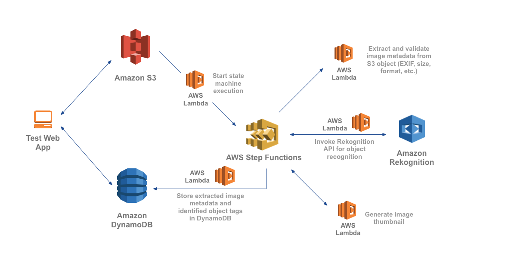

# Serverless Reference Architecture: Image Recognition and Processing Backend

The Image Recognition and Processing Backend demonstrates how to use [AWS Step Functions](https://aws.amazon.com/step-functions/) to orchestrate a serverless processing workflow using [AWS Lambda](http://aws.amazon.com/lambda/), [Amazon S3](http://aws.amazon.com/s3/), [Amazon DynamoDB](http://aws.amazon.com/dynamodb/) and [Amazon Rekognition](https://aws.amazon.com/rekognition/). This workflow processes photos uploaded to Amazon S3 and extracts metadata from the image such as geolocation, size/format, time, etc. It then uses image recognition to tag objects in the photo. In parallel, it also produces a thumbnail of the photo.

This repository contains sample code for all the Lambda functions depicted in the diagram below as well as an AWS CloudFormation template for creating the functions and related resources. There is also a test web app that you can run to interact with the backend.



### Walkthrough of the architecture
1. An image is uploaded to the `PhotoRepo` S3 bucket under the `private/{userid}/uploads` prefix
2. The S3 upload event triggers the `S3Trigger` Lambda function, which kicks off an execution of the `ImageProcStateMachine` in AWS Step Functions, passing in the S3 bucket and object key as input parameters.
3. The `ImageProcStateMachine` has the following sub-steps:
  * Read the file from S3 and extract image metadata (format, EXIF data, size, etc.)
  * Based on output from previous step, validate if the file uploaded is a supported file format (png or jpg). If not, throw `NotSupportedImageType` error and end execution.
  * Store the extracted metadata in the `ImageMetadata` DynamoDB table
  * In parallel, kick off two processes simultaneously: 
     * Call Amazon Rekognition to detect objects in the image file. If detected, store the tags in the `ImageMetadata` DynamoDB table
     * Generate a thumbnail and store it under the `private/{userid}/resized` prefix in the `PhotoRepo` S3 bucket 


### How to deploy
Follow these instructions to deploy the application (both backend and frontend):

[](https://console.aws.amazon.com/amplify/home#/deploy?repo=https://github.com/aws-samples/lambda-refarch-imagerecognition)
 
1. Use **1-click deployment** button above. Amplify Console will fork this repository in your GitHub account, and deploy the backend and frontend application.
    - Note: If you forked and changed the repository first, you can use the Amplify console and select "**Connect App**" to connect to your forked repo. 
1. For IAM Service Role, create one if you don't have one or select an existing role. (This is required because the Amplify Console needs permissions to deploy backend resources on your behalf. More [info](https://docs.aws.amazon.com/amplify/latest/userguide/how-to-service-role-amplify-console.html))
    
1. Within your new app in Amplify Console, wait for deployment to complete (this may take a while)
1. Once the deployment is complete, you can test out the application! 
 
If you want to make changes to the code locally: 
 
1. Clone the repo in your Github account that Amplify created 
1. In the Amplify console, choose **Backend environments**, and toggle "Edit backend" on the environment with categories added
1. Under **Edit backend**, copy the `amplify pull --appId <your app id> --envName <your env name>` command displayed
    - If you don't see this command and instead see `amplify init --appId`, try refreshing the backend environment tab after waiting a few minutes (cloudformation could still be provisioning resources)
1. Within your forked repository locally, run the command you copied and follow the instructions

 ```
    - This command synchronizes what's deployed to your local Amplify environment
    - Do you want to use an AWS profile: Yes
    - default
    - Choose your default editor: Visutal Studio Code
    - Choose the type of app that you're building: javascript
    - What javascript framework are you using: react
    - Source Directory Path:  src/react-frontend/src
    - Distribution Directory Path: src/react-frontend/build
    - Build Command:  npm.cmd run-script build  
    - Start Command: npm.cmd run-script start
    - Do you plan on modifying this backend? (Yes)
 ```
 
If at anytime you want to change these options. Look into `amplify/.config/project-config.json` and make your changes there.

### Using the test web app

You can use the test web app to upload images and explore the image recognition and processing workflow. 


#### Sign up and log in

1. Go to the URL of the Amplify app that was deployed 
1. In the login page, click on "**Create account**"
1. Register an account by following the sign up instructions

    

1. After confirming the account, sign in 

##### Album list

1. create albums using the "Add a new album" 
    
1. You may need to referresh 

##### Photo gallery

1. Click into an album you created
1. Upload a photo
    
1. You can follow the Step Functions execution link to review the details of the workflow execution 
    Below is the diagram of the state machine being executed every time a new image is uploaded 
    (you can explore this in the Step Functions [Console](https://console.aws.amazon.com/states/home)):
    
    
1. When the processing finishes, the photo and extracted information is added to the display
     

## Cleaning Up the Application Resources

To remove all resources created by this example, do the following:
1. Go to [AWS CloudFormation console](https://console.aws.amazon.com/cloudformation/home), delete the 2 stacks with name "amplify-photoshare-" 
1. Go to the [AWS Amplify console](https://console.aws.amazon.com/amplify/home) and delete the app.

## License

This reference architecture sample is licensed under Apache 2.0.

 
