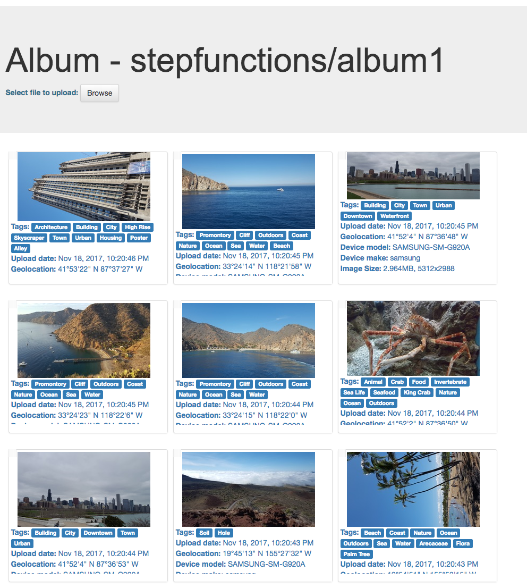

# Additional Steps

Now that you have created an application with StepFunctions and a web application to interact with it, it's time to earn a few extra credits!

The challenges here are, pick your battle :)

### Step A: Implement retries within the state-machine, not in the code.

Some errors might require a retry due to throttling of endpoints, timeouts on Lambdas, unexpected exceptions and execution errors. As Werner Vogels, Amazon's CTO once said: "*everything fails, all the time*"!

The challenge here is, by using our documentation about [retries](http://docs.aws.amazon.com/step-functions/latest/dg/amazon-states-language-errors.html), you should be able to implement retries of each task whenever is needed. A good rule-of-thumb is to specify the set of errors that should not be retried, then set a retry policy to catch all other errors. 

> e.g. If the image type is not supported, there is no point on retrying. However, if PersistDDB fails with *"ProvisionedThroughputExceededException"*, we should retry storing the data. You can play with the different backoffs and max attempts in these settings. 
> 
> You can test your retry policies by simulating different errors. For example, the extract image metadata lambda function can take a few seconds to run for a large image. You can go to the lambda console and change the extract image metadata function timeout to 1 second and pass an image greater than 2MB into the state machine and verify the retries kick in. 


### Step B: Manual approval for suspected inappropriate content

Customers will upload their photos within your platform. Some of this content might be considered inappropriate for your application.

**Amazon Rekognition** allows you to flag this content easily with the API call [DetectModerationLabels](http://docs.aws.amazon.com/rekognition/latest/dg/API_DetectModerationLabels.html).

The challenge here is to implement it with a manual approval activity in StepFunctions. You can do it within the *ExtractMetadata* Task or you can implement a subsequent task to moderate these images.


> - Refer to this [blog](https://aws.amazon.com/blogs/compute/implementing-serverless-manual-approval-steps-in-aws-step-functions-and-amazon-api-gateway/) on an example of implementing a manual approval step in Step Functions  
> 
> - Because Rekognition gives you a confidence value from 0-100 on the moderation labels, you can consider using a **Choice State** to automatically reject photos with a high confidence of inappropriate content, and use manual approval for mild suspects.
>
> - You need to create a new Lambda function to identify the inappropiate content. You can also find some SDK examples for [Python](https://boto3.readthedocs.io/en/latest/reference/services/rekognition.html#Rekognition.Client.detect_moderation_labels) or [node.js](http://docs.aws.amazon.com/AWSJavaScriptSDK/latest/AWS/Rekognition.html#detectModerationLabels-property). Choose the one you prefer and implement this task!
> 
> - Don't forget to add the result in the *ResultPath*. Review previous steps to find more information about how to implement *Choices*, *Tasks* and [here](https://aws.amazon.com/blogs/compute/implementing-serverless-manual-approval-steps-in-aws-step-functions-and-amazon-api-gateway/) to implement an [activity](http://docs.aws.amazon.com/step-functions/latest/dg/concepts-activities.html).
> 
> - Test your StateMachine... Carefully!
> 

A quick view of how your state machine "might" look like:


As you can see, the state SendToApproval is waiting for the activity to be approved. You can find the API calls to approve or to deny these tasks [here](http://docs.aws.amazon.com/step-functions/latest/apireference/API_SendTaskSuccess.html) and [here](http://docs.aws.amazon.com/step-functions/latest/apireference/API_SendTaskFailure.html).

For example, here are two simple scripts to approve or to deny your activities:

***Approve***
```
aws stepfunctions send-task-success --task-token $(aws stepfunctions get-activity-task --activity-arn arn:aws:states:us-west-2:012344556789:activity:sendToApproval | jq .taskToken) --task-output "{}"
```
***Deny***
```
aws stepfunctions send-task-failure --task-token $(aws stepfunctions get-activity-task --activity-arn arn:aws:states:us-west-2:031877956887:activity:sendToApproval | jq .taskToken) --error "InappropiateError"
```
<details>
<summary><strong> Expand to see JSON definition</strong></summary><p>

```JSON
{
  "StartAt": "ExtractImageMetadata",
  "Comment": "New State Machine - Created with StepEasy",
  "States": {
    "ExtractImageMetadata": {
      "Type": "Task",
      "Resource": "arn:aws:lambda:us-west-2:012345678901:function:sfn-workshop-setup-ExtractMetadata",
      "Catch": [
        {
          "ErrorEquals": [
            "ImageIdentifyError"
          ],
          "ResultPath": "",
          "Next": "NotSupportedImageType"
        }
      ],
      "ResultPath": "$.extractedMetadata",
      "Next": "ImageTypeCheck"
    },
    "NotSupportedImageType": {
      "Type": "Fail",
      "Cause": "Image type not supported!",
      "Error": "FileNotSupported"
    },
    "ImageTypeCheck": {
      "Type": "Choice",
      "Choices": [
        {
          "Or": [
            {
              "Variable": "$.extractedMetadata.format",
              "StringEquals": "JPEG"
            },
            {
              "Variable": "$.extractedMetadata.format",
              "StringEquals": "PNG"
            }
          ],
          "Next": "DetectInappropiate"
        }
      ],
      "Default": "NotSupportedImageType"
    },
    "DetectInappropiate":{
        "Type": "Task",
        "Resource": "arn:aws:lambda:us-west-2:012345678901:function:detectInappropiate",
        "ResultPath": "$.inappropiate",
        "Next": "IsItAppropiate"
      },
      "IsItAppropiate":{
        "Type": "Choice",
        "Choices": [
          {
              "Not": {
                "Variable": "$.inappropiate",
                "BooleanEquals": true
              },
              "Next": "Parallel"
          }
        ],
        "Default": "SendToApproval"
      },
      "SendToApproval":{
        "Type": "Task",
        "Resource": "arn:aws:states:us-west-2:012345678901:activity:sendToApproval",
        "Catch": [
          {
            "ErrorEquals":[ "States.ALL" ],
            "Next": "NotSupportedImageType"
          }
        ],
        "ResultPath": "$.approval",
        "Next": "Parallel"
      },
    "Parallel": {
      "Type": "Parallel",
      "Branches": [
        {
          "StartAt": "DetectLabelsRekognition",
          "Comment": " - Created with StepEasy",
          "States": {
            "DetectLabelsRekognition": {
              "Type": "Task",
              "Resource": "arn:aws:lambda:us-west-2:012345678901:function:sfn-workshop-setup-DetectLabel",
              "End": true
            }
          }
        },
        {
          "StartAt": "Thumbnail",
          "Comment": " - Created with StepEasy",
          "States": {
            "Thumbnail": {
              "Type": "Task",
              "Resource": "arn:aws:lambda:us-west-2:012345678901:function:sfn-workshop-setup-Thumbnail",
              "End": true
            }
          }
        }
      ],
      "ResultPath": "$.parallelResults",
      "Next": "PersistDDB"
    },
    "PersistDDB": {
      "Type": "Task",
      "Resource": "arn:aws:lambda:us-west-2:012345678901:function:sfn-workshop-setup-PersistDDB",
      "End": true
    }
  }
}
```

</details>

### Step C: Bulk copy of images to S3 to test concurrency

Now you have tested the workflow end to end with a few sample images, we can add load to this setup by copying images from a S3 bucket with thousands of images into your photo landing bucket.

Follow the instructions here to setup the state machine:

[https://github.com/awslabs/sync-buckets-state-machine](https://github.com/awslabs/sync-buckets-state-machine)

This uses a different state machine to sync contents of 2 buckets in the same region:


For source bucket, please use the following depending on the AWS region you've been using:


Region | S3 Bucket to copy from
------|-------
EU (Ireland) | <span style="font-family:'Courier';"> sfn-image-workshop-bulk-photo-copy-eu-west-1 </span>
US East (N. Virginia) | <span style="font-family:'Courier';"> sfn-image-workshop-bulk-photo-copy-us-east-1 </span>
US West (Oregon) | <span style="font-family:'Courier';">sfn-image-workshop-bulk-photo-copy-us-west-2 </span>

Input to the state machine to sync contents would look like this:

```
{
  "source": "sfn-image-workshop-bulk-photo-copy-eu-west-1",
  "destination": "<REPLACE_WITH_YOUR_PhotoLandingS3Bucket>",
  "prefix": "Incoming/"

}
```


Use `stepfunction` user in the web application to explore the imported images 


you should see a list of albums:


Explore the tags, metadata and thumbnails generated: 



#### Monitoring and metrics

Explore the execution metrics by going to the CloudWatch Metrics console and search for the State Machine name. Use the "Sum" statistic for success/failure metrics:


Did all images copied into your bucket get processed by Step Functions? You can find out by two ways:

1. Go to the metrics for the Lambda trigger function (in the [Lambda console](https://us-west-2.console.aws.amazon.com/lambda/home?region=us-west-2), search for function name containing ```StartExecution```). Click on the function and go to the **monitoring** tab. Do you see any **Invocation errors**? Check the Lambda logs to see what the error is
1. Go to the DynamoDB table (look for table name starting with ```sfn-workshop-resources-ImageMetadataDDBTable-```) and look for entries with **errReason** field (or with **executionArn** field equals **ERR**):


