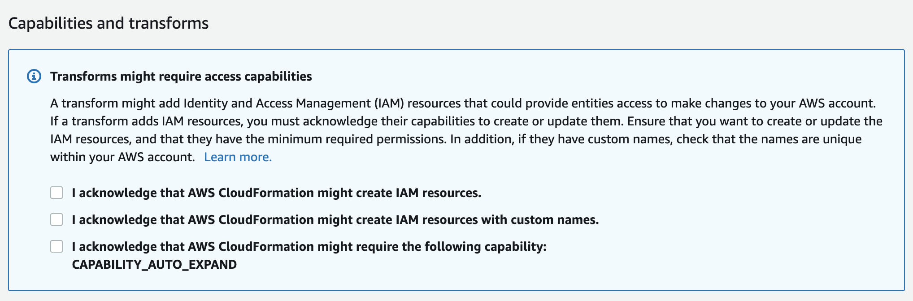

## Step 0: Set up resources

### Step 0A: Set up Lambda functions and data stores

The AWS Step Functions state machine you will create in this workshop coordinates a number of Lambda functions that implement the logic for each step. Some of those Lambda functions rely on the existance of AWS resources and data stores, such as an Amazon S3 bucket or an Amazon DynamoDB table.

In this section, you will use a cloudformation template to provision the AWS Lambda functions plus all the resources that those require.

To help you understand what resources are set up in this stage, refer to the diagram below. In this workshop, you will build a Step Functions state machine (greyed out in the middle) to orchestrate the lambda functions that does the processing work:
<br/>


<br/>
<br/>

Region| Code | Launch
------|------|-------
US West (Oregon) | <span style="font-family:'Courier';">us-west-2</span> | [](https://console.aws.amazon.com/cloudformation/home?region=us-west-2#/stacks/new?stackName=sfn-workshop-setup&templateURL=https://s3-us-west-2.amazonaws.com/image-processing-step-functions-workshop-us-west-2/cloudformation/step0-sam.yaml)


<details>
<summary><strong> CloudFormation launch instructions (expand for details) </strong></summary><p>

1. Click the **Launch Stack** link above for the region of your choice.

1. Click **Next** on the Select Template page.

1. On the ```Specify stack details``` page, leave all the defaults and click **Next**.

1. On the ```Configure stack options``` page, also leave all the defaults and click **Next**.

1. On the ```Review page```, check all the boxes to acknowledge that CloudFormation will create IAM resources and CAPABILITY_AUTO_EXPAND and click **Create Stack**.

	

	This template creates a number of IAM roles to grant the Lambda fuctions proper permissions on the resources they have to deal with.

1. Wait for the `sfn-workshop-setup` stack to reach a status of `CREATE_COMPLETE` (you might need to click the refresh button to see the stack being created).
</details>


### Next step
You are now ready to move on to [Step 1](step-1.md)!
