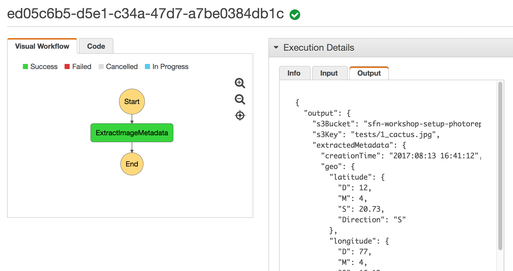

## Step 1: Adding first Lambda step to a AWS Step Functions state machine

To build an AWS Step Functions state machine to coordinate the processing steps, we will start with the machine containing a single step. 

Step Functions state machines are defined in JSON using the [Amazon States Language](https://states-language.net/spec.html). Take a look at the below JSON that defines a state machine with a single step:

```javascript
{
  "StartAt": "ExtractImageMetadata",
  "Comment": "Imgage Processing State Machine",
  "States": {
    "ExtractImageMetadata": {
      "Type": "Task",
      "Resource": "arn:aws:lambda:us-west-2:012345678912:function:sfn-workshop-setup-ExtractMetadata",
      "End": true
    }
  }
}
```	

When this state machine is launched, the AWS Step Functions interpreter begins execution by identifying the Start State. It executes that state, and then checks to see if the state is marked as an End State. If it is, the machine terminates and returns a result. If the state is not an End State, the interpreter looks for a “Next” field to determine what state to run next; it repeats this process until it reaches a Terminal State (Succeed, Fail, or an End State) or a runtime error occurs.

When you are constructing a state machine definition by authoring JSON directly, make sure to use [statelint](https://github.com/awslabs/statelint) tool to validate your JSON before creating the state machine. 

Another option is to use a visual editor tool to generate the JSON, such as [Step Easy](http://step-easy.s3-website-us-west-2.amazonaws.com/)


### Step 1A: Add AWS Lambda Task state 

1. Open the [Step Easy](http://step-easy.s3-website-us-west-2.amazonaws.com/) tool and name the state machine `Image Processing State Machine`
	

1. Drag an AWS Lamdba Task into the canvas and click the edit button. Name the state `ExtractImageMetadata` and paste in the ARN of the lambda function that does metadata extraction 
	> To find the ARN of the metadata extraction AWS Lambda function, in the AWS CloudFormation Console, go to the **sfn-workshop-setup** stack, look in the Outputs section for **ExtractMetadataLambda**
	> 
	> It should look something like `arn:aws:lambda:us-west-2:<YOUR-ACCOUNT-ID>:function:sfn-workshop-setup-ExtractMetadata`

	

1. Draw a connector between the state machine start point and the Lambda Task on the canvas

1. Click **Export** to get the generated JSON of the state machine definition

### Step 1B: Create an initial AWS Step Functions state machine

1.  Go to [AWS Step Functions management console](http://console.aws.amazon.com/states/home)

1.  You might see the Get Started page if you have not used AWS Step Functions before. If that's the case, click **Get Started**, it should lead you to the page to create a new state machine. Otherwise, click the **Create a State Machine** button.

1. Type `ImageProcessing-1` for the state machine name

1. Scroll down until you see the section **Step3: Review your code and visual workflow**.  
Paste in the JSON exported from Step Easy tool in Step 1A

1. You can click on the &#x21ba; icon next to **Visual Workflow** to refresh the visual representation of the state machine:

 

1. Click **Create State Machine** to create the state machine.

1. In the pop-up window, select the IAM role automatically generated for you (the name should look like `StatesExecutionRole-{region-name}`).

	

### Step 1C: Test the state machine execution

1. Click the **New execution** button to start a new execution.

1. Here you specify the input data passed into the AWS Step Functions state machine to process.

   Each execution of a Step Functions state machine has an unique ID. You can either specify one when starting the execution, or have the service generate one for you. In the text field that says "enter your execution id here",  you can specify an execution ID, or leave it blank. 

	For input data, use the following JSON template. Make sure to substitute the s3Bucket field with your own value.

	```JSON
	{
	  "s3Bucket": "FILL_IN_YOUR_VALUE",
	  "s3Key": "tests/1_cactus.jpg"
	}
	```

	> The `s3Bucket` and `s3Key` fields tell the image processing workflow the Amazon S3 bucket and key the picture is stored at.
	   
	For `s3Bucket` field, look in the **Output** section of the **sfn-workshop-setup** stack for `PhotoRepoS3Bucket`.  
	
	We recommend you save the test input JSON in a text editor (Sublime, Notepad++, etc.) as we will reuse it in later steps.
	
	Click **Start Execution**
	

	

1.  You can now see the state machine execution in action. Explore the different tabs in the Console to see what information is available to you for this execution:

	


### Step 1D: Using ResultPath to join output with original input

If you take a look at the **Output** of the state machine we just created, it has lots of useful information about the metadata that was extracted from the image by the Lambda function, but what if we also want to pass down the original input data that was passed to this step? e.g. subsequent steps also need reference to the s3Bucket and s3Key that the image is stored at. 

One option is to write this logic in the Lambda function itself to copy the input data into the output of the Lambda function. Alternatively, Step Functions provides a feature we can leverage -- **Paths**. This feature allows to manipulate the input passed into a task and the output of task passed on to the next state using a JSON path expression.

There are three different types of **Paths** fields: **InputPath**, **ResultPath** and **OutputPath**. (Read more about the Paths feature in [documentation](https://docs.aws.amazon.com/step-functions/latest/dg/awl-ref-paths.html) and [Amazon States Language specification.](https://states-language.net/spec.html#path) ) 

For our specific need we will use the **ResultPath** field. This field defines for passing on data to the next state, which part of the input JSON will be replaced by the result of the execution (e.g. output of the Lambda function). By default (if omitted), this field takes on `$`, which means the execution result will the be entire data passed on to the next (OutputPath allows further filtering of the output of ResultPath). That behavior can be changed by explicitly specifying a JSON path: 
 
- If the **ResultPath** JSON path expression matches an item in the state's input, only that input item is overwritten with the results of executing the state's task. The entire modified input becomes available to the state's output.

- If the **ResultPath** JSON path expression does not match an item in the state's input, that item is added to the input. The item contains the results of executing the state's task. The expanded input becomes available to the state's output.

1. AWS Step Functions needs to keep track of every state machine versions, since there may be instances of multiple versiones simultaneously. The way the user interface reflects that for the time being is by not allowing you to edit an existing state machine. Instead you will have to create a new one. 

	On the AWS Step Functions management console page click on **Dashboard** to go back to your list of state machines.
	
1. Select `ImageProcessing-1` and click **Copy to New**

1. Leave all the defaults, scroll down to the section **Step3: Review your code and visual workflow**, and add the attribute `"ResultPath": "$.extractedMetadata"` to the task. The final JSON should look like the following:

	```javascript
	{
	  "StartAt": "ExtractImageMetadata",
	  "Comment": "Image Processing State Machine",
	  "States": {
	    "ExtractImageMetadata": {
	      "Type": "Task",
	      "Resource": "arn:aws:lambda:us-west-2:012345678912:function:sfn-workshop-setup-ExtractMetadata",
	      "ResultPath": "$.extractedMetadata",
	      "End": true
	    }
	  }
	}
	```
1. Click **Create State Machine**

1. Select the `StatesExecutionRole-{region-name}` execution role

1. Click **Ok**

1. Click **New Execution**

1. Enter the same JSON input you used on Step 1C-2 (you can find it by going to the execution history of the `ImageProcessing-1` and copy the JSON from the details>Input plane) and click **Start Execution**
	
	

1. Let it finish and verify that the **Output** contains now the state input attributes plus an additional field `extractedMetadata` that contains the task ouput, effectively merging both the input and the output

	

1. You are now ready to move on to [Step 2](step-2.md)!
