## Step 2: Add branching logic to state machine

The first step of state machine gives us more information about the image file, which can be used to determine what set of further actions the workflow needs to take, e.g. if the file supplied is a format not supported by our image recognition service, send it to another Lambda function that performs type conversion or simply send an error notification to the customer and terminate the workflow.

There are two mechanisms in AWS Step Functions that enables branching: [Choice State](https://docs.aws.amazon.com/step-functions/latest/dg/awl-ref-states-choice.html)  and [Error Try/Catches](https://docs.aws.amazon.com/step-functions/latest/dg/awl-ref-errors.html). Choice State allows choosing the next state based on if/else or case/switch conditions (supports a combination of And Or Not and = > < operators ) on the input data. Error Try/Catches allows choosing the next state depending on the type of error thrown by the current execution.

In this step, we will add input validation to the state machine by leveraging both Error Try/Catches and Choice State. By the end of this step the state machine will look like this:

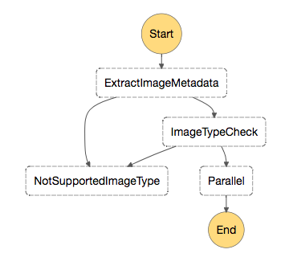

### Step 2A: Add branching to State Machine definition

Consider in our scenario we only support JPEG and PNG formats. The image analysis Lambda function can detect image formats, so we can use a Choice State after the first step to evaluate the output from the metadata extraction and make branching decisions. For other file types the image processing library does not even have an analyzer for, an exception is thrown from the Lambda function. So here we can combine using Choice State and Error Try/Catch. 

1. Go back to the [Step Easy](http://step-easy.s3-website-us-west-2.amazonaws.com/) tool. Because in Step 1D we modified the JSON by adding the **ResultPath** parameter, you can use **Import** button in Step Easy to load the latest definition.
	<details>
	<summary><strong> Expand to see screenshot</strong></summary><p>
	 
	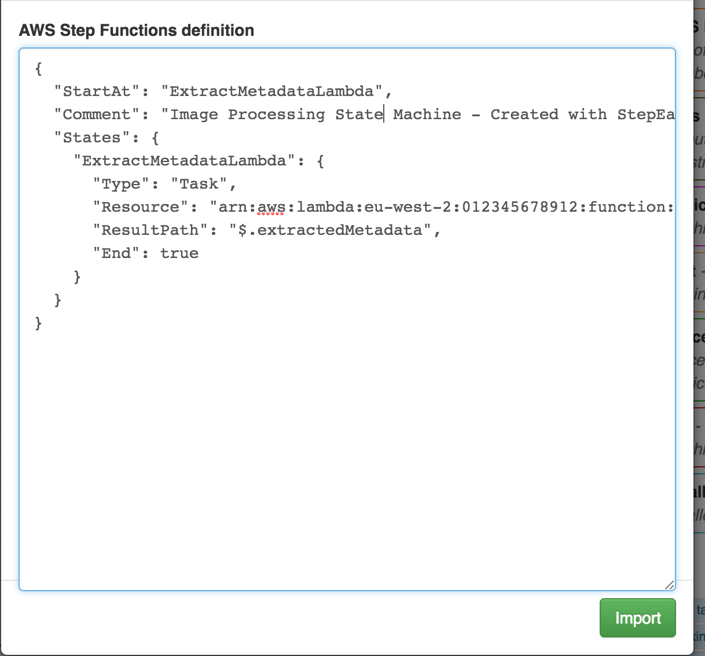
	</details>

1. The next step we are going to add to our state machine is the fail state, *NotSupportedImageType*. This step will terminate and mark failure for executions that cannot proceed because the image type is not supported.

	<details>
	<summary><strong> Expand to see detailed instructions</strong></summary><p>
 
	a. Drag and drop a **Fail** step into the canvas 
	
	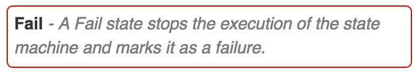

	b. Edit the fail state by clicking on the pencil icon. Set the state name, cause and error fields to the values specified on the image below
	
	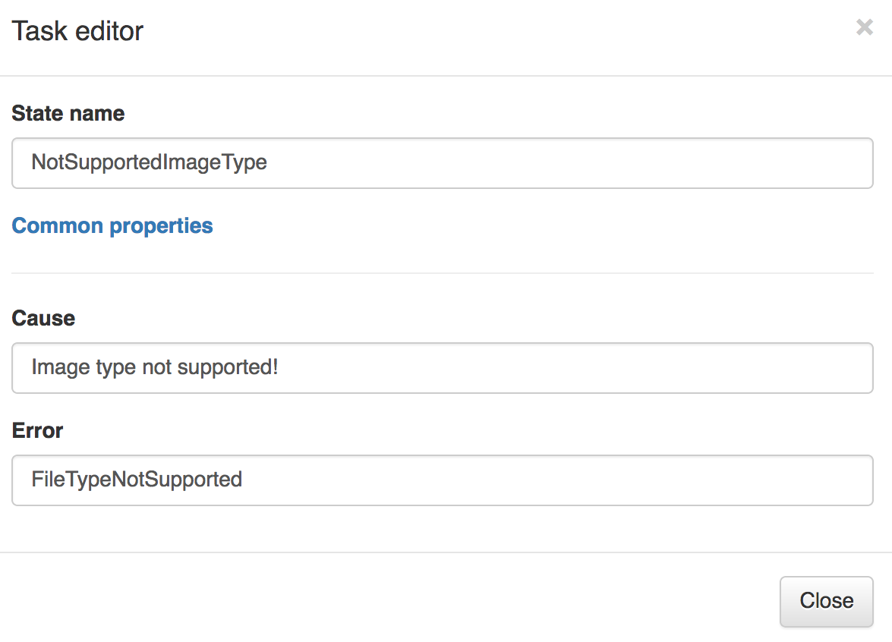

	</details>


1. Next, we add an error try/catch to the *ExtractImageMetadata* step pointing to the fail state. The lambda function is written so that when it encounters a file type (e.g. txt) that it can't parse as an image, it will throw an error of type `ImageIdentifyError`. Using the Error try/catch functionality of Step Functions, we can configure the state machine to transition to *NotSupportedImageType* Fail state.

	> See this [blog post](https://aws.amazon.com/blogs/compute/automating-aws-lambda-function-error-handling-with-aws-step-functions/) on how to define custom error codes in Lambda functions in different languages. 
	
	<details>
	<summary><strong> Expand to see detailed instructions </strong></summary><p>
	
	 Click on **Catchers** link on the bottom right corner of the *ExtractImageMetadata* step box. Then click **Add Catcher** and set the Error and Next State fields as referred below.
	
	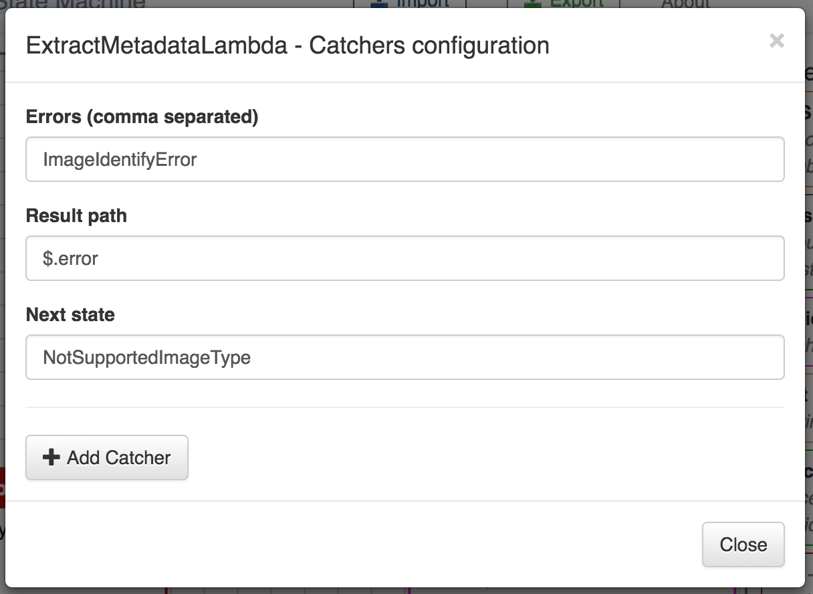
	 
	</details>
	
  
1. To ensure only JPEG and PNG images are allowed to be further processed, we create a Choice state that directs to the *NotSupportedImageType* Fail state when the image format is not JPEG or PNG. 

	
	<details>
	<summary><strong> Expand to see detailed instructions </strong></summary><p>
	
	 a. Drag and drop the **Choice** into the canvas.
	 
	 b. Edit the the **Choice** by clicking on the pencil icon. Add the State name and Default behavior (the state the choice will transition to by default)

	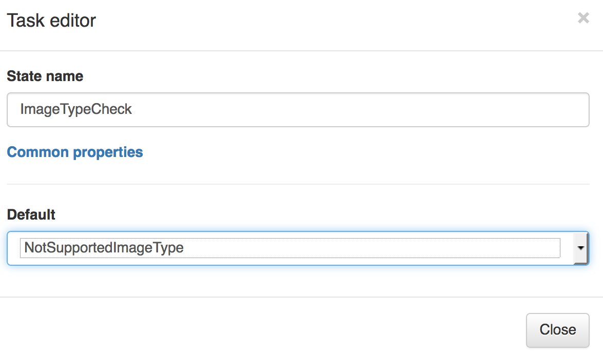

	This default behavior will route all those images that does not meet the supported image types to the *NotSupportedImageType* fail state.

	c. Click on the "+" icon to add a condition. Now click on the pencil icon show in the picture below to configure the condition.

	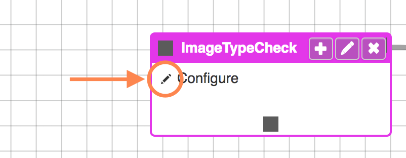

	d. Click the **Add logical operator** link at the top. Select *Or* from the drop down list.
	
	e. Click **Add condition**. Set Variable to `$.extractedMetadata.format` Comparison to `StringEquals` and Value to JPEG
	
	f. Click **Add condition** again. Set Variable to `$.extractedMetadata.format` Comparison to `StringEquals` and Value to PNG.
	
	g. Compare your settings with the following image

	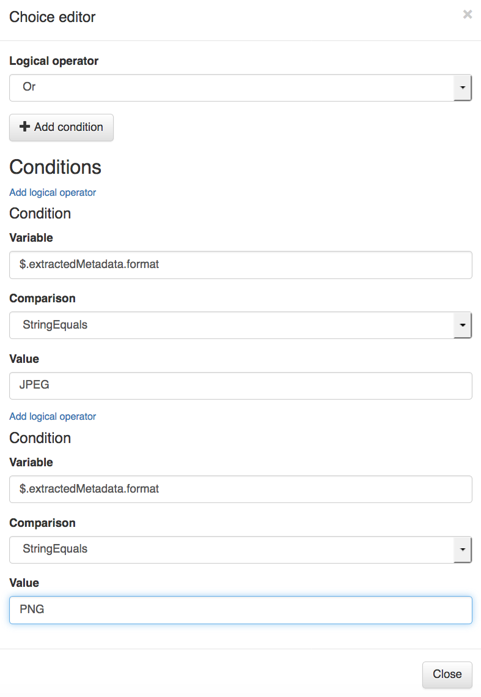

	h. Close the pop-up. Connect the *ExtractImageMetadata* state with the *ImageTypeCheck* choice state
	
	 
	i. Drag and drop a **Pass State** into the canvas. This state will be modified later with a **Parallel** state in subsequent steps of this workshop.
	
	j. Edit it with the details showed on the image below:

	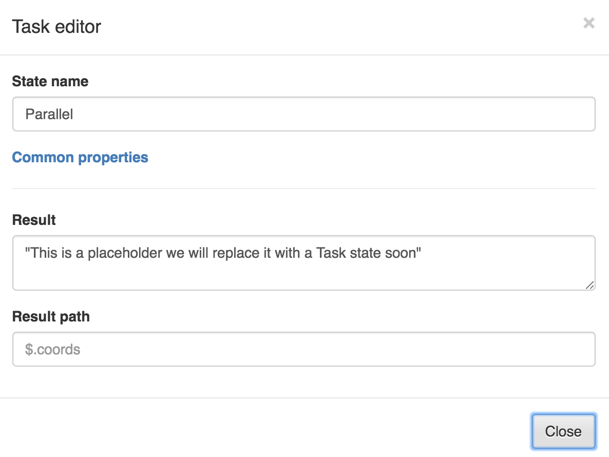

	k. Connect the *ImageTypeCheck* choice state to the *Parallel* state.  
	At the end of this last step, the canvas should look like this one:

	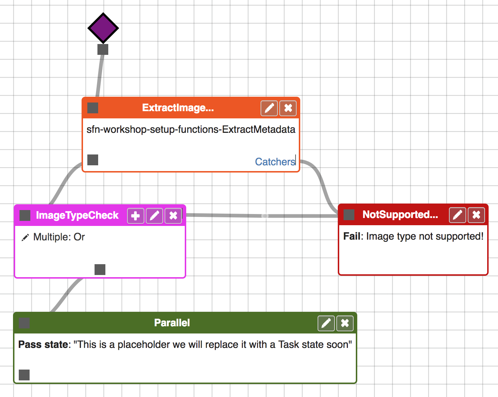
	</details>


1. Click **Export** in the Step Easy tool to get the output JSON. 


### Step 2B: Update the AWS Step Functions state machine

1. Go to [AWS Step Functions management console](http://console.aws.amazon.com/states/home). Make sure the AWS Region selection matches the one you have been working with so far.

1. Select the `ImageProcessing` state machine. Click on **Edit state machine**

1. Scroll down and paste in the JSON generated from Step Easy tool in Step 2A

1. Locate the JSON snippet that corresponds to the definition of the `NotSupportedImageType` state. Remove the attribute `"End": true` from it (make sure the JSON document continues to be well-formend by removing the comma character right before the `End` attribute. The JSON of this state should be like this:

	```javascript
	"NotSupportedImageType": {
	      "Type": "Fail",
	      "Cause": "Image type not supported!",
	      "Error": "FileTypeNotSupported"
	    },
	
	```

1. You can click on the &#x21ba; icon next to **Visual Workflow** to refresh the visual representation of the state machine:

	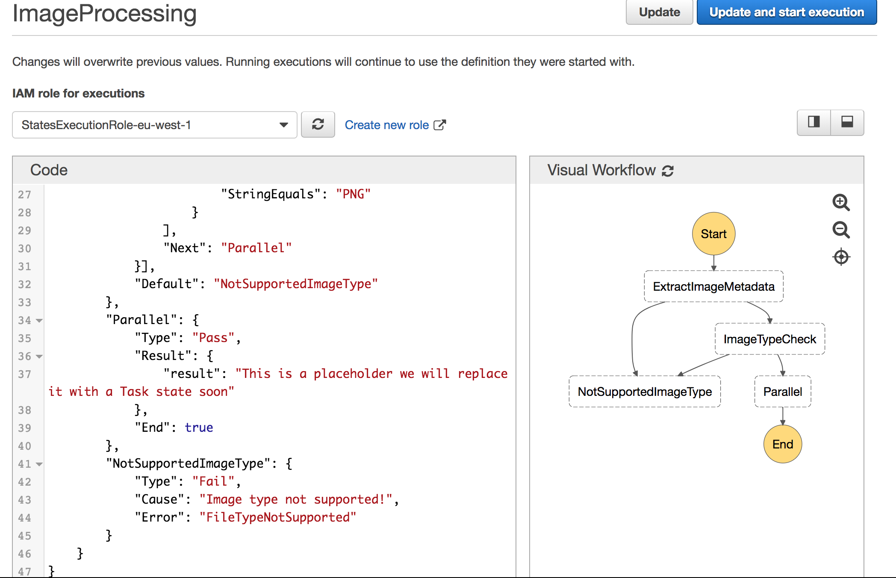

1. Click **Update and start execution**
	

### Step 2C: Test the state machine execution

1. Test this new state machine with the same input you did in **Step 1C**

	```JSON
	{
	  "s3Bucket": "FILL_IN_YOUR_VALUE",
	  "s3Key": "tests/1_cactus.jpg"
	}
	```

	You will see that the execution succeededs and the workflow shows this output:
	
	```JSON
	{
	  "output": "This is a placeholder we will replace it with a Task state soon"
	}
	```
	Also, you will see that the workflow has passed through all the steps till the end:
	
	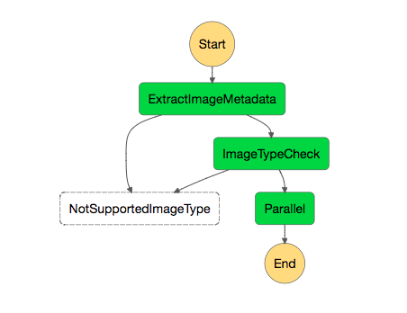

1. Now, let's try it with a different input (*.tiff* image type):

	```JSON
	{
	  "s3Bucket": "FILL_IN_YOUR_VALUE",
	  "s3Key": "tests/2_lake_snow.tiff"
	}
	```
	We used an unsupported image type! Here is the output we see:
	
	```JSON
	{
	  "error": "FileTypeNotSupported",
	  "cause": "Image type not supported!"
	}
	```
	Hence, the workflow of the execution confirms our mistake:
	
	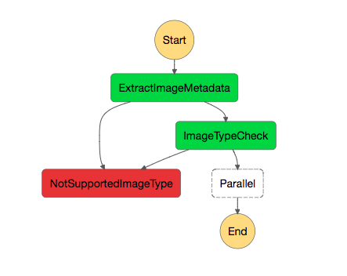

1. Test it with a txt file that we have wrongly appended with .jpg suffix:

	```JSON
	{
	  "s3Bucket": "FILL_IN_YOUR_VALUE",
	  "s3Key": "tests/3_txt_prentending_jpg.jpg"
	}
	```
	
	We expect the *ExtractImageMetadata* lambda function to throw an `ImageIdentifyError`, which will direct the flow to the fail state, without even hitting the **Choice** state
	
	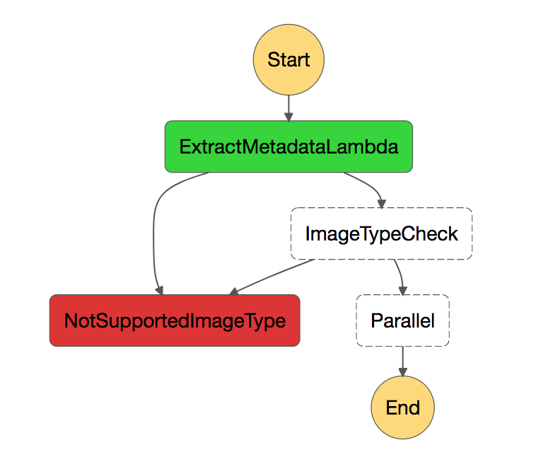
	

### Final JSON

If you had issues along the way and your state machine does not work as expected, double check that your JSON definition is consistent with the one below. 
<details>
<summary><strong> Expand to see JSON definition</strong></summary><p>

```JSON
{
	"StartAt": "ExtractImageMetadata",
	"Comment": "Image Processing State Machine - step 2 final",
	"States": {
		"ExtractImageMetadata": {
			"Type": "Task",
			"Resource": "arn:aws:lambda:us-west-2:012345678901:function:sfn-workshop-setup-ExtractMetadata",
			"Catch": [{
				"ErrorEquals": [
					"ImageIdentifyError"
				],
				"ResultPath": "$.error",
				"Next": "NotSupportedImageType"
			}],
			"ResultPath": "$.extractedMetadata",
			"Next": "ImageTypeCheck"
		},
		"ImageTypeCheck": {
			"Type": "Choice",
			"Choices": [{
				"Or": [{
						"Variable": "$.extractedMetadata.format",
						"StringEquals": "JPEG"
					},
					{
						"Variable": "$.extractedMetadata.format",
						"StringEquals": "PNG"
					}
				],
				"Next": "Parallel"
			}],
			"Default": "NotSupportedImageType"
		},
		"Parallel": {
			"Type": "Pass",
			"Result": {
				"result": "This is a placeholder we will replace it with a Task state soon"
			},
			"End": true
		},
		"NotSupportedImageType": {
			"Type": "Fail",
			"Cause": "Image type not supported!",
			"Error": "FileTypeNotSupported"
		}
	}
}
```
</details>

If problems persist, you can always use that final JSON to create a working state machine. Just make sure to update the AWS Region and AWS Account ID in the Lambda function ARN to reflect your setup.


### Next step
You are now ready to move on to [Step 3](step-3.md)!


