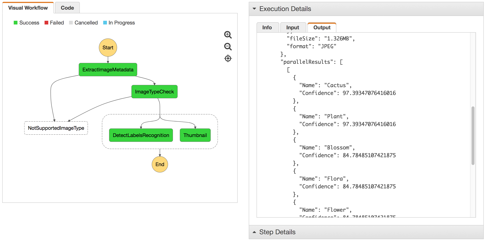

## Step 3: Add parallel processing to the workflow

After extracting and checking the metadata, we are now ready to add a few more steps to our state machine: thumb-nailing, image recognition and persisting/indexing the metadata. Thumb-nailing and image recognition does not depend on each other and can happen in parallel, and we can use a [parallel state](https://docs.aws.amazon.com/step-functions/latest/dg/amazon-states-language-parallel-state.html) in Step Functions.


### Step 3A: Update the state machine definition

Now you acquired some experience with incrementally adding steps to the state machine, deploying, and testing it, give it a shot to add a parallel step to our current state machine (remember to export it or take it from the Final JSON of the last step) in step-easy that performs thumb-nailing and image recognition in parallel.

Take a look at these documentation if you need help with the syntax:

- [Parallel State](https://docs.aws.amazon.com/step-functions/latest/dg/amazon-states-language-parallel-state.html)
- [Task State](https://docs.aws.amazon.com/step-functions/latest/dg/amazon-states-language-task-state.html)
- [Amazon States Language Spec](https://states-language.net/spec.html)

We suggest now to edit the JSON directly, so that links to the documentation referred above are easier to follow.

<details>
<summary><strong> Expand to get some hints </strong></summary><p>

- The first step is to change the type of the *Parallel* state from **Pass** to **Parallel**.

- Parallel acitivies within a **Parallel** state are specified as an array of objects, each of one is, in turn, a self-contained state machine object.

	```JSON
	"Parallel": {
	  "Type": "Parallel",
	  "Branches": [<STATE_MACHINE_OBJECT>, ..., <STATE_MACHINE_OBJECT>],
	  "End": true
	}
	```

- For each branch create a state machine object with one **Task** state that triggers the corresponding Lambda function:
	- ``sfn-workshop-setup-DetectLabel``, that leverages the deep learning-based image analyis [Amazon Rekognition](https://aws.amazon.com/rekognition/) service and, in particular, its [DetectLabels API](http://docs.aws.amazon.com/rekognition/latest/dg/API_DetectLabels.html), to obtain metadata about what objects and concepts appear on the processed image. 
	
	- ``sfn-workshop-setup-Thumbnail``, that relies on [GraphicsMagick for node.js](http://aheckmann.github.io/gm/docs.html) library to generate the thumbnails

</details>

Now is a good time to remember Step 1D, where we learned how to merge the input of a state with its output, so that both become available to states further down the line using the [AWS Step Functions Paths feature]((https://docs.aws.amazon.com/step-functions/latest/dg/awl-ref-paths.html)).

In particular use **ResultPath** in the *Parallel* state to make sure the array of parallel state machine outputs are made available to downstream states. Use the `parallelResults` attribute for that.

<details>
<summary><strong> Expand to get some hints </strong></summary><p>

```JSON
"Parallel": {
  "Type": "Parallel",
  "Branches": [<STATE_MACHINE_OBJECT>, ..., <STATE_MACHINE_OBJECT>],
  "ResultPath": "$.parallelResults",
  "End": true
}
```
</details>


Now, test your state machine with the images you want!

- Make sure that both labels detected by Amazon Rekognition and the S3 location of the thumbnails are available in the output.

	

- Verify that the tumbnails are in the S3 bucket, under the **Thumbnail** folder


### Final JSON
<details>
<summary><strong> Expand to see JSON definition</strong></summary><p>

```JSON
{
  "StartAt": "ExtractImageMetadata",
  "Comment": "Image Processing State Machine - step 3 final",
  "States": {
    "ExtractImageMetadata": {
      "Type": "Task",
      "Resource": "arn:aws:lambda:us-west-2:012345678901:function:sfn-workshop-setup-ExtractMetadata",
      "Catch": [
        {
          "ErrorEquals": [
            "ImageIdentifyError"
          ],
          "ResultPath": "$.error",
          "Next": "NotSupportedImageType"
        }
      ],
      "ResultPath": "$.extractedMetadata",
      "Next": "ImageTypeCheck"
    },
    "ImageTypeCheck": {
      "Type": "Choice",
      "Choices": [
        {
          "Or": [
            {
              "Variable": "$.extractedMetadata.format",
              "StringEquals": "JPEG"
            },
            {
              "Variable": "$.extractedMetadata.format",
              "StringEquals": "PNG"
            }
          ],
          "Next": "Parallel"
        }
      ],
      "Default": "NotSupportedImageType"
    },
    "NotSupportedImageType": {
      "Type": "Fail",
      "Cause": "Image type not supported!",
      "Error": "FileTypeNotSupported"
    },
    "Parallel": {
      "Type": "Parallel",
      "Branches": [
        {
          "StartAt": "DetectLabelsRekognition",
          "States": {
            "DetectLabelsRekognition": {
              "Type": "Task",
              "Resource": "arn:aws:lambda:us-west-2:012345678901:function:sfn-workshop-setup-DetectLabel",
              "End": true
            }
          }
        },
        {
          "StartAt": "Thumbnail",
          "States": {
            "Thumbnail": {
              "Type": "Task",
              "Resource": "arn:aws:lambda:us-west-2:012345678901:function:sfn-workshop-setup-Thumbnail",
              "End": true
            }
          }
        }
      ],
      "ResultPath": "$.parallelResults",
      "End": true
    }
  }
}

```
</details>

### Next step
You are now ready to move on to [Step 4](step-4.md)!

