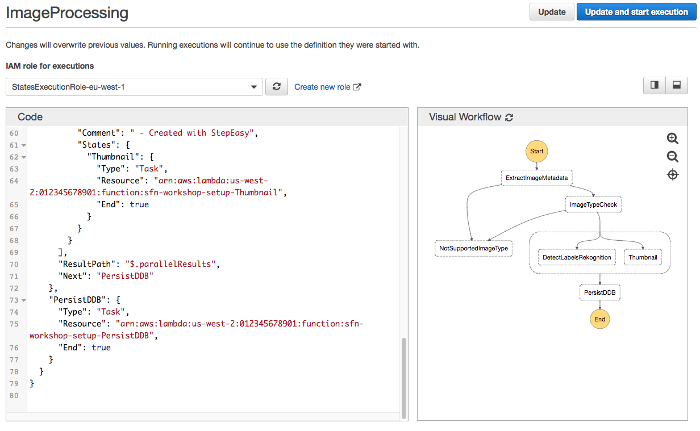

## Step 4: Persisting labels and image metadata

At this point, we should have our state machine generating Thumbnails and metadata, as well as detecting what objects and concepts are in the images (labels).


### Step 4A: Add a step to store the metadata in DynamoDB

For this part we will again edit the JSON manually.  Go to your editor of choice used previously and paste in the final JSON you ended up with on Step 3.  From there add one more step to your state machine, to execute the Lambda function `sfn-workshop-setup-PersistDDB` that takes care of storing everything in DynamoDB.

Take a look at this documentation if you need help with the syntax:

- [Task State](https://docs.aws.amazon.com/step-functions/latest/dg/amazon-states-language-task-state.html)
- [Amazon States Language Spec](https://states-language.net/spec.html)

	> To find the ARN of the Lambda function, in the AWS CloudFormation Console, go to the **sfn-workshop-setup** stack and look in the Outputs section for **StoreImageMetadataFunction**
	>
	> It should look something like `arn:aws:lambda:us-west-2:<YOUR-ACCOUNT-ID>:function:sfn-workshop-setup-PersistDDB`

1. Make the new step you've just added, be the next step after the Parallel step.  

1. Copy the produced JSON. If you're having trouble, you can find the JSON at the bottom of this page.


### Step 4B: Create an AWS Step Functions state machine to test the result

1.  Go to [AWS Step Functions management console](http://console.aws.amazon.com/states/home). 

1. Select the `ImageProcessing` state machine. Click on **Edit state machine**

1. Paste in the JSON from your editor produced in Step 4A

1. Click on the &#x21ba; icon next to **Visual Workflow** to refresh the visual representation of the state machine:

	

1. Click **Update and start execution**


### Step 4C: Test the state machine execution

1. Use the following input you have been using so far to test the execution

	```JSON
	{
	  "s3Bucket": "FILL_IN_YOUR_VALUE",
	  "s3Key": "tests/1_cactus.jpg"
	}
	```


1. Verify that everything came out fine and the workflow succesfully executed all the steps:

	

1. You may also want to check what DynamoDB tables and items stored in them look like. Navigate to the [Amazon DynamoDB management console](https://console.aws.amazon.com/dynamodb/home?#tables:). You should see two tables there with names similar to the following ones:

	- `sfn-workshop-setup-AlbumMetadataDDBTable`
	- `sfn-workshop-setup-ImageMetadataDDBTable`

1. Click on the `sfn-workshop-setup-ImageMetadataDDBTable` and the click on the **Items** folder. Verify there is one entry for each sucessfully processed image:

	


1. Click on an item and have a look at its structure:

	


### Final JSON
<details>
<summary><strong> Expand to see JSON definition</strong></summary><p>

```JSON
{
  "StartAt": "ExtractImageMetadata",
  "Comment": "Image Processing State Machine",
  "States": {
    "ExtractImageMetadata": {
      "Type": "Task",
      "Resource": "arn:aws:lambda:us-west-2:012345678901:function:sfn-workshop-setup-ExtractMetadata",
      "Catch": [
        {
          "ErrorEquals": [
            "ImageIdentifyError"
          ],
          "ResultPath": "$.error",
          "Next": "NotSupportedImageType"
        }
      ],
      "ResultPath": "$.extractedMetadata",
      "Next": "ImageTypeCheck"
    },
    "NotSupportedImageType": {
      "Type": "Fail",
      "Cause": "Image type not supported!",
      "Error": "FileNotSupported"
    },
    "ImageTypeCheck": {
      "Type": "Choice",
      "Choices": [
        {
          "Or": [
            {
              "Variable": "$.extractedMetadata.format",
              "StringEquals": "JPEG"
            },
            {
              "Variable": "$.extractedMetadata.format",
              "StringEquals": "PNG"
            }
          ],
          "Next": "Parallel"
        }
      ],
      "Default": "NotSupportedImageType"
    },
    "Parallel": {
      "Type": "Parallel",
      "Branches": [
        {
          "StartAt": "DetectLabelsRekognition",
          "States": {
            "DetectLabelsRekognition": {
              "Type": "Task",
              "Resource": "arn:aws:lambda:us-west-2:012345678901:function:sfn-workshop-setup-DetectLabel",
              "End": true
            }
          }
        },
        {
          "StartAt": "Thumbnail",
          "States": {
            "Thumbnail": {
              "Type": "Task",
              "Resource": "arn:aws:lambda:us-west-2:012345678901:function:sfn-workshop-setup-Thumbnail",
              "End": true
            }
          }
        }
      ],
      "ResultPath": "$.parallelResults",
      "Next": "PersistDDB"
    },
    "PersistDDB": {
      "Type": "Task",
      "Resource": "arn:aws:lambda:us-west-2:012345678901:function:sfn-workshop-setup-PersistDDB",
      "End": true
    }
  }
}
```
</details>

### Next step
You are now ready to move on to [Step 5](step-5.md)!
