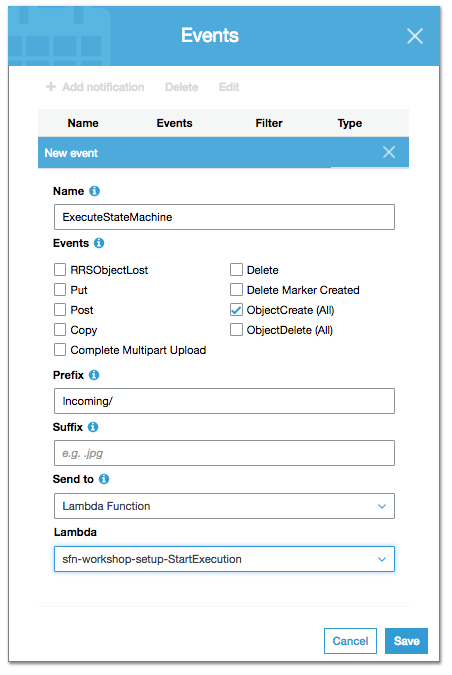

## Step 5: Start execution from an S3 event

Finally, we have our state machine up and running! It's time to automate its execution.
As images are uploaded to the landing S3 bucket we want the state machine to be triggered.

We have two possibilities here:

1. Use CloudWatch Events to monitor activity on the S3 bucket and select Step Functions as the target for its execution

1. Use a Lambda Function that:
	- Invokes the state machine  
	- Is triggered by an S3 event  

The first step requires some extra configuration as it needs CloudTrail to be enabled. For brevity, we will go with Option 2.

### Step 5A: Instruct StartExecution Lambda function what Step Functions state machine it is to be triggered

1. Go to [AWS Step Functions management console](http://console.aws.amazon.com/states/home). Make sure the AWS Region selection matches the one you have been working with so far.

1. On the Dashboard locate your state machine. If you followed instructions on prior steps it should be *ImageProcessing*

1. On the **Details** box, find and copy the **ARN**: 

	

1. Navigate to the [AWS Lambda management console](https://console.aws.amazon.com/lambda/home) and find the Lambda function with a name that ends with `StartExecution`. That is the one that triggers the state machine. Select it by clicking on the link on its name.

1. The specific AWS Step Function state machine it launches is passed to the Lambda function as a configurable environment variable. Scroll down to the **Environment variables** section. Expand it and change the placeholder value `FILL_WITH_YOUR_VALUE` to the ARN of your state machine.

	
	
1. Scroll up to the top of the page and click **Save**

### Step 5B: Set up S3 event to trigger StartExecution Lambda function

The Lambda function now knows what state machine we want it to run. Now we need to set up the event that will, in turn, trigger the Lambda function. Since we want it to be launched automatically whenever a new object is uploaded to the landing bucket, we need the Lambda funtion to be triggered by an S3 event.

1. Go to the S3 management console and select the landing bucket:

	```
	sfn-workshop-setup-photorepos3bucket-xxxxxxxxxxxxx
	```
	
1. Create a folder and call it *Incoming*

	
	
1. Click on the **Properties** tab

1. Click on **Events**

	
	
1. Click on **Add notification**

1. Enter the following parameters:  
	- **Name**: ExecuteStateMachine
	- **Events**: All object create events
	- **Prefix**: Incoming/
	- **Send to**: Lambda Function
	- **Lambda**: sfn-workshop-setup-StartExecution

	> **Note:** the **Prefix** parameter is critical: this limits the event trigger to only trigger processing workflows when an image file lands in the "Incoming/" prefix. Because the thumbnail generation process uploads the thumbnails to the same S3 bucket, without limiting the prefix, the thumbnail upload will trigger another workflow and causes an infinite loop.  
	
	
	
1. Click **Save**

### Step 5C: Test the event trigger by uploading a photo to S3

Now you are ready to test your event! Just upload an image within the S3 bucket into the "Incoming" folder and check the execution in the Step Functions console!

1. On the S3 management console go to the `Incoming/` prefix on the landing bucket and click **Upload**. Select an image with a supported format (JPEG or PNG). Click **Next**


1. Click **Next** and **Upload**  

1. Verify that the state machine is triggered and it executes successfully. Verify the metadata of the new image processed is stored in DynamoDB.
	
	


### Next step
You are now ready to move on to [Step 6](step-6.md)!


