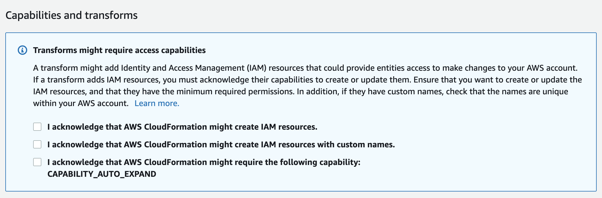
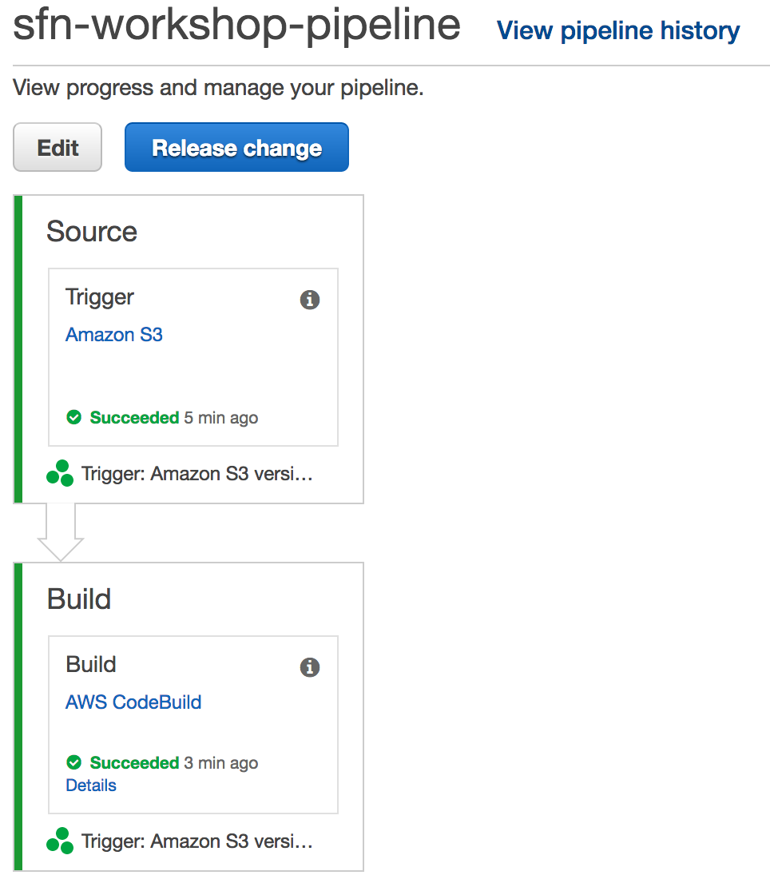
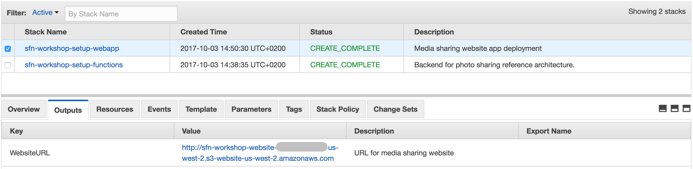
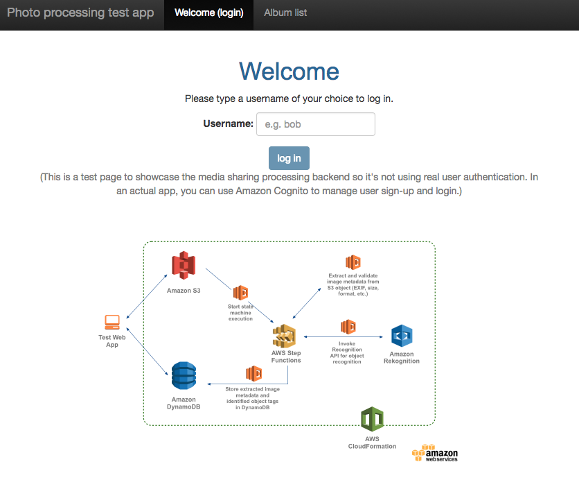
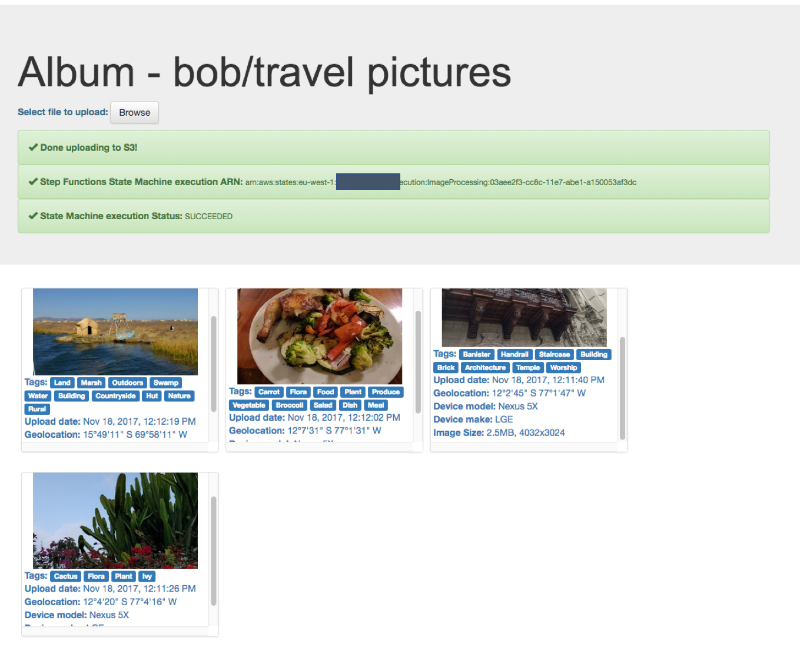

# Step 6: Build and Launch the web application

To see the processing workflow in action, we will use an AngularJS web application to create photo albums and upload pictures to them.

### Step 6A: Set up the Photo Processing Web Application

To complete the workshop tests, you will use an AngularJS web application to create photo albums and upload pictures to them.

In this section, you will use a cloudformation template to package and deploy the web application on an S3 bucket configured for website hosting.

> This cloudformation template leverages AWS CodeBuild and AWS CodePipeline to automate building, packaging and deploying the web application

Region| Code | Launch
------|------|-------
US East (Ohio)| <span style="font-family:'Courier';">us-east-2</span> | [](https://console.aws.amazon.com/cloudformation/home?region=us-east-2#/stacks/new?stackName=sfn-workshop-setup-webapp&templateURL=https://s3-us-east-2.amazonaws.com/image-processing-step-functions-workshop-us-east-2/cloudformation/step0-webapp.yaml)
US East (N. Virginia) | <span style="font-family:'Courier';">us-east-1</span> | [](https://console.aws.amazon.com/cloudformation/home?region=us-east-1#/stacks/new?stackName=sfn-workshop-setup-webapp&templateURL=https://s3.amazonaws.com/image-processing-step-functions-workshop-us-east-1/cloudformation/step0-webapp.yaml)
US West (Oregon) | <span style="font-family:'Courier';">us-west-2</span> | [](https://console.aws.amazon.com/cloudformation/home?region=us-west-2#/stacks/new?stackName=sfn-workshop-setup-webapp&templateURL=https://s3-us-west-2.amazonaws.com/image-processing-step-functions-workshop-us-west-2/cloudformation/step0-webapp.yaml)
EU (Ireland) | <span style="font-family:'Courier';">eu-west-1</span> | [](https://console.aws.amazon.com/cloudformation/home?region=eu-west-1#/stacks/new?stackName=sfn-workshop-setup-webapp&templateURL=https://s3-eu-west-1.amazonaws.com/image-processing-step-functions-workshop-eu-west-1/cloudformation/step0-webapp.yaml)
Tokyo | <span style="font-family:'Courier';">ap-northeast-1</span> | [](https://console.aws.amazon.com/cloudformation/home?region=ap-northeast-1#/stacks/new?stackName=sfn-workshop-setup-webapp&templateURL=https://s3-ap-northeast-1.amazonaws.com/image-processing-step-functions-workshop-ap-northeast-1/cloudformation/step0-webapp.yaml)
Sydney | <span style="font-family:'Courier';">ap-southeast-2</span> | [](https://console.aws.amazon.com/cloudformation/home?region=ap-southeast-2#/stacks/new?stackName=sfn-workshop-setup-webapp&templateURL=https://s3-ap-southeast-2.amazonaws.com/image-processing-step-functions-workshop-ap-southeast-2/cloudformation/step0-webapp.yaml)
Mumbai | <span style="font-family:'Courier';">ap-south-1</span> | [](https://console.aws.amazon.com/cloudformation/home?region=ap-south-1#/stacks/new?stackName=sfn-workshop-setup-webapp&templateURL=https://s3-ap-south-1.amazonaws.com/image-processing-step-functions-workshop-ap-south-1/cloudformation/step0-webapp.yaml)

#### CloudFormation launch instructions

1. Click the **Launch Stack** link above for the region of your choice (make sure to pick the same region you have launched your other resources in)

1. Click **Next** on the Select Template page.

1. On the ```Specify stack details``` page, leave all the defaults and click **Next**.

1. On the ```Configure stack options``` page, also leave all the defaults and click **Next**.

1. On the ```Review page```, check all the boxes to acknowledge that CloudFormation will create IAM resources and CAPABILITY_AUTO_EXPAND and click **Create Stack**.

	

1. Wait for the `sfn-workshop-setup-webapp` stack to reach a status of `CREATE_COMPLETE` (you might need to click the refresh button to see the stack being created).

	The stack will take a minute of so to complete. As part ot that, it copies the web application sources over to the target bucket and that will trigger the delivery pipleline.

1. Go to the [AWS CodePipeline management console](http://console.aws.amazon.com/codepipeline/home). Click on the pipeline identified by `sfn-workshop-pipeline` and verify it finishes succesfully.  
	

1. Go to the [AWS CloudFormation management console](http://console.aws.amazon.com/cloudformation/home). With the stack `sfn-workshop-setup-webapp` selected click on the Outputs tab. The `WebsiteURL` key points at the link to access the **Image Sharing demo Web Application**

	

1. Click on that link to navigate to the **Media Sharing Web Application**

**Note: Make sure to use Chrome browser to open the web application.**



</p></details>

### Step 6B: Test the end-to-end workflow using the sample web app
##### Login
Pick any username to log in (This is a test app to showcase the backend so it's not using real user authentication. In an actual app, you can use Amazon Cognito to manage user sign-up and login.)

The username will be used in storing ownership metadata of the uploaded images.

##### Album list
Create new or select existing albums to upload images to.

##### Photo gallery
Upload images and see status updates when:

1. Upload to S3 bucket succeeds
2. The AWS Step Function execution is started. The execution ARN is provided in the UI so you can easily look up its details in the Step Functions [Console](https://console.aws.amazon.com/states/home)
3. The AWS Step Function execution completes

A sample set of extracted image metadata and recognized tags, along with the thumbnail generated in the Step Function execution is displayed for each uploaded image.




### Next step: extra credits

Now you have built a end-to-end image processing workflow using Step Functions, ready for some fun challenges?

See the [extra credits](./additional-steps.md) section

If you are ready to clean up resources created for this workshop, see the [cleanup](./clean-up.md) instructions
